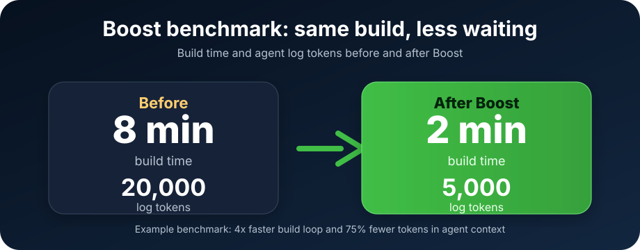
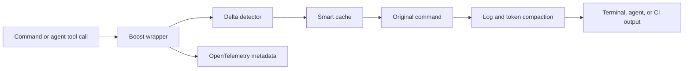
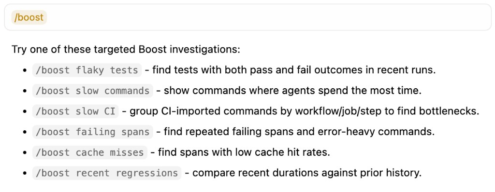

<p align="center">
  <a href="https://jfrog.github.io/boost/">
    <picture>
      <source srcset=".github/assets/boost-logo-dark.png" media="(prefers-color-scheme: dark)">
      <source srcset=".github/assets/boost-logo-light.png" media="(prefers-color-scheme: light)">
      
    </picture>
  </a>
</p>

<p align="center">
  <strong>Boost</strong> — faster agents, faster CI
</p>

<p align="center">
  <sub>For coding agents, their commands, and the CI that runs them.</sub>
</p>

<p align="center">
  <a href="https://jfrog.github.io/boost/"></a>
  
  <a href="https://github.com/jfrog/boost/releases"></a>
  <a href="./LICENSE"></a>
  <a href="https://jfrog.com"></a>
</p>

<p align="center">
  
  
  <a href="https://go.dev/"></a>
  
  <a href="https://github.com/jfrog/boost/releases"></a>
  <a href="https://github.com/jfrog/boost/stargazers"></a>
</p>

<p align="center">
  <sub>Built and supported by <a href="https://jfrog.com"><strong>JFrog</strong></a></sub>
</p>

---

Humans and coding agents spend too much time waiting for commands to finish and sifting through noisy output. **Boost** is a single binary that drops into three places at once:

- your **terminal** — prefix any command with `boost`
- your **coding agent** — `boost init` wires up Cursor, Claude Code, Codex, Gemini CLI, and more
- your **CI** — one line: `uses: jfrog/boost@v1`

Same binary, same acceleration, same telemetry — wherever your builds run.

## Quick Start

**CLI** - install once, then prefix any command with `boost`.

```bash
curl -fsSL https://raw.githubusercontent.com/jfrog/boost/main/install.sh | bash
boost init
```

**GitHub Actions** - add Boost before your build steps.

```yaml
name: ci

on: [push, pull_request]

jobs:
  build:
    runs-on: ubuntu-latest
    steps:
      - uses: jfrog/boost@v0
      - uses: actions/checkout@v4
      ...
```

`boost init` detects your installed editors and CI providers, then registers hooks so every tool call your agent makes can run through Boost. Pin to a specific release such as `jfrog/boost@v1.0.0` when you need reproducible CI.

## Why Boost

- **One binary, three surfaces** - CLI, coding agent, and CI all share the same runtime and behave identically.
- **75% fewer log tokens in the benchmark below** - compact command output before it reaches your agent's context window.
- **Deep OTel context** - every wrapped command emits OpenTelemetry traces and metrics your agents can reason about.
- **Supported by JFrog** - distributed as a signed binary through GitHub Releases.

## Benchmark: before / after

<p align="center">
  
</p>

Same build, same result. Boost keeps the signal and removes the wait:

- **Build time:** 8 minutes -> 2 minutes.
- **Agent context:** 20,000 tokens -> 5,000 tokens.
- **Traceability:** timing, cache hits, and exit codes are captured as OpenTelemetry metadata.

```bash
# Without boost - long logs, repeated work
$ npm ci && npm test
build finished in 8m 04s
~20,000 log tokens emitted

# With boost - cached work, compact output, same exit behavior
$ boost npm ci && boost npm test
[OK] build finished in 2m 01s - cache hit summary available - ~5,000 tokens emitted
```

## How it works (High Level)

Boost is a local wrapper around the commands you already run. It does not need your source code in the cloud to make builds quieter and faster.



At a high level, Boost:

- detects the changed inputs that matter for the wrapped command;
- reuses safe cached work when the content fingerprint matches;
- keeps raw command behavior and exit codes intact;
- condenses repetitive logs before they enter an agent context window;
- emits metadata such as duration, cache status, and exit code through OpenTelemetry.

## Supported tools

**Coding agents:** Cursor · Claude Code · GitHub Copilot · Codex CLI · Gemini CLI · OpenCode · Windsurf · Cline

**CI platforms:** GitHub Actions · GitLab CI *(coming soon)* · Jenkins *(coming soon)* · CircleCI *(coming soon)* · Azure Pipelines *(coming soon)*

## Usage examples

Prefix any command with `boost` - anywhere you'd normally run it.

- `boost docker build ...` - compressed build log, layer-cache summary, Docker metrics in OTel
- `boost npm ci` - dependency summary, local package cache, retry-safe output
- `boost pytest` - per-test pass/fail/duration stored locally, quiet output on green runs
- `boost gh run view --log` - CI log stream condensed to top failures plus summary

Boost also gives agents targeted investigations they can run directly:

<p align="center">
  
</p>

## FAQ

### Why is Boost free?

Boost started as an internal JFrog tool for making AI agents and CI loops faster. We decided to share it with the developer community because faster, more observable agent workflows help the whole AI engineering ecosystem move forward.

### Is Boost open source?

The Boost binary is free to use under the JFrog Online Beta Agreement, but it is proprietary software. See [LICENSE](LICENSE) and [BETA_AGREEMENT.md](BETA_AGREEMENT.md) for the current terms.

### Does Boost upload my source code or logs?

No. Boost is local-first: raw logs, command history, and traces stay on your machine unless you explicitly export metadata. See [Security & Privacy](#security--privacy) and [SECURITY.md](./SECURITY.md).

### What should I add to CI?

Start with the GitHub Action, then prefix expensive commands with `boost`.

```yaml
steps:
  - uses: jfrog/boost@v1
  - uses: actions/checkout@v4
  ...
```

## Update

```bash
boost update
```

## Documentation

See the [full documentation](https://jfrog.github.io/boost) for commands, configuration, OpenTelemetry export, and CI recipes.

## Security & Privacy

- **Local-first.** Command history and raw OTel traces stay on your machine.
- **Only metadata leaves.** Exported spans carry timing, exit code, and cache stats — never raw logs, file contents, or env values. Secrets matching patterns like `*_TOKEN`, `*_SECRET`, `AWS_*`, `DATABASE_URL` are redacted before write or export.
- **Open protocol, signed binaries.** OpenTelemetry-native; point `BOOST_OTEL_ENDPOINT` at your own backend. Binaries ship signed via GitHub Releases.

Full policy, supported versions, and how to report a vulnerability: see [SECURITY.md](./SECURITY.md).

## License

Copyright © 2026 JFrog Ltd. All rights reserved. See [LICENSE](LICENSE) and [BETA_AGREEMENT.md](BETA_AGREEMENT.md).

---

*Dedicated to the memory of Dima Gershovich — a brilliant engineer, a talented musician, and a dear friend.* [Read Dima's story](docs/memorial/MEMORIAL.md)